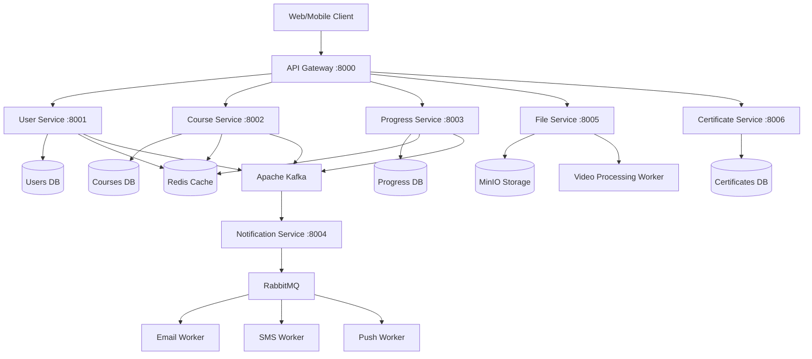

# EduPlatform - Enterprise Microservices Learning Management System

## Why This Project?

### The Problem
Modern online education platforms face critical challenges:
- **Monolithic architectures** that don't scale with user growth
- **Poor performance** when handling thousands of concurrent video streams
- **Limited real-time features** for student engagement and progress tracking
- **Lack of reliability** - when one component fails, entire platform goes down
- **Difficult maintenance** - changes to one feature break unrelated functionality
- **Slow feature delivery** - all teams must coordinate for every release

### The Solution
EduPlatform demonstrates how to build a production-ready, scalable learning platform using:
- **Microservices architecture** - independent services scale separately based on demand
- **Event-driven design** - real-time notifications and progress tracking without tight coupling
- **Async processing** - handle video uploads and processing without blocking user experience
- **Fault tolerance** - service failures don't cascade across the entire system
- **Independent deployment** - teams ship features without coordinating releases

### What You'll Learn
This project showcases senior-level backend development skills:
- Designing distributed systems that handle millions of users
- Implementing message queues and event streaming for reliability
- Building async APIs that remain responsive under load
- Creating proper database architectures with multiple data stores
- Setting up monitoring and observability for production systems
- Writing maintainable, testable code following SOLID principles

## Architecture Overview

**Microservices Pattern**: Each service owns its data and communicates through events



## Quick Start

### Prerequisites

- Python 3.11+
- Poetry
- Docker & Docker Compose
- Make (optional)

### Installation

```bash
# Clone repository
git clone https://github.com/LarisaShirokikh/eduplatform_backend.git
cd eduplatform

# Install dependencies
make install
# or
poetry install --extras all

# Create project structure
make create-structure

# Setup environment
cp .env.example .env
# Edit .env with your configuration

# Start infrastructure
make infrastructure

# Initialize database
make init-db
make seed-data

# Run services for development
make dev-api-gateway    # API Gateway on port 8000
make dev-user-service   # User Service on port 8001
make dev-course-service # Course Service on port 8002
```

## Key Features

### User Management
- Registration and authentication with JWT
- Role-based access control (student, instructor, admin)
- Profile management
- OAuth integration ready

### Course Management
- Course and lesson CRUD operations
- Categories and tags
- Pricing and discounts
- Full-text search with Elasticsearch

### Progress Tracking
- Real-time progress updates via Kafka events
- Learning analytics and insights
- Time tracking per lesson/course
- Personalized course recommendations

### Notification System
- Multi-channel notifications (Email, SMS, Push)
- Template-based messaging
- Async processing with RabbitMQ
- Delivery status tracking

### File Management
- Video upload and streaming
- Automatic video transcoding (multiple qualities)
- Thumbnail generation
- CDN integration for fast delivery

### Certificates
- Automatic generation on course completion
- PDF certificates with custom templates
- Blockchain verification (optional)
- Public verification endpoint

## Technology Stack

### Backend
- **FastAPI** - Modern async web framework
- **SQLAlchemy 2.0** - Async ORM with type hints
- **Alembic** - Database migrations
- **Pydantic V2** - Data validation and settings

### Databases
- **PostgreSQL** - Primary data storage
- **Redis** - Caching and sessions
- **Elasticsearch** - Full-text search

### Message Brokers
- **Apache Kafka** - Event streaming between services
- **RabbitMQ** - Task queues and notifications

### Infrastructure
- **Docker & Docker Compose** - Containerization
- **MinIO** - S3-compatible object storage
- **Celery** - Background tasks

### Monitoring
- **Prometheus** - Metrics collection
- **Grafana** - Dashboards and visualization
- **Structured logging** with structlog

### Development Tools
- **Poetry** - Dependency management
- **Pytest** - Testing framework
- **Black + isort** - Code formatting
- **MyPy** - Static type checking
- **Pre-commit hooks** - Quality checks before commit

## Testing

```bash
# Run all tests
make test

# Unit tests only
make test-unit

# Integration tests
make test-integration

# With coverage
poetry run pytest --cov=shared --cov=services --cov-report=html
```

Test categories:
- **Unit tests** - Isolated component testing
- **Integration tests** - Service interaction testing
- **Performance tests** - Load and stress testing

## Monitoring

### Prometheus Metrics
- Request count per service
- API response times
- Error rates and status codes
- Resource utilization

### Grafana Dashboards
- Platform overview
- User metrics
- Course analytics
- Service performance

### Logging
- Structured JSON logs
- Correlation IDs across services
- Centralized log aggregation

## Security

- JWT authentication with refresh tokens
- Password hashing with bcrypt
- Rate limiting at API Gateway
- Input validation with Pydantic
- CORS policies
- Dependency vulnerability scanning

```bash
make security-scan
```

## Production Deployment

```bash
# Build production images
make prod-build

# Deploy
make prod-deploy

# Monitor logs
make prod-logs
```

## API Documentation

After starting services:
- **Swagger UI**: http://localhost:8000/docs
- **ReDoc**: http://localhost:8000/redoc
- **OpenAPI JSON**: http://localhost:8000/openapi.json

## Development Workflow

1. Create feature branch
2. Develop functionality
3. Write tests
4. Run `make lint` and `make test`
5. Create Pull Request

## Skills Demonstrated

This project showcases production-ready backend development:

- **Microservices Architecture** - Service decomposition and boundaries
- **Event-Driven Design** - Kafka for service communication
- **Async Programming** - Non-blocking I/O with Python asyncio
- **Database Design** - Multi-database architecture per service
- **Caching Strategies** - Redis for performance optimization
- **Message Queues** - RabbitMQ for task processing
- **API Design** - RESTful APIs with proper status codes
- **Authentication** - JWT with refresh tokens
- **Testing** - Unit, integration, and performance tests
- **Monitoring** - Metrics, logs, and dashboards
- **DevOps** - Docker, CI/CD readiness
- **Documentation** - Comprehensive technical docs

## Troubleshooting

### Service Issues
```bash
make health-check  # Check all services
make logs          # View logs
make clean && make infrastructure  # Rebuild environment
```

### Database Issues
```bash
make db-shell      # Connect to database
make create-migration MESSAGE="fix issue"
make migrate       # Apply migrations
```

### Kafka Issues
```bash
make kafka-topics  # List topics
make kafka-consume TOPIC=user.registered  # Read messages
```

## Available Commands

```bash
make help                 # Show all commands
make infrastructure      # Start infrastructure
make services            # Start all microservices
make test                # Run tests
make lint                # Check code quality
make format              # Format code
make health-check        # Check service status
```

## Service Endpoints

After running `make infrastructure`:

| Service | URL | Credentials |
|---------|-----|-------------|
| **API Gateway** | http://localhost:8000 | - |
| **Grafana** | http://localhost:3000 | admin/admin |
| **Prometheus** | http://localhost:9090 | - |
| **RabbitMQ** | http://localhost:15672 | eduuser/edupass |
| **MinIO** | http://localhost:9001 | eduuser/edupassword |
| **Elasticsearch** | http://localhost:9200 | - |

**Databases:**
- PostgreSQL: `localhost:5432` (eduuser/edupass)
- Redis: `localhost:6379`
- Kafka: `localhost:9092`

## Contributing

Contributions welcome! Please:
1. Fork the repository
2. Create a feature branch
3. Add tests for new functionality
4. Ensure all tests pass
5. Submit a Pull Request

## License

MIT License - see LICENSE file for details

## Author

**Larisa Shirokikh**
- GitHub: [@LarisaShirokikh](https://github.com/LarisaShirokikh)
- Email: larisashirokikh@yandex.ru

## Project Status

**Version**: 0.1.0
**Status**: Active Development

This is a portfolio project demonstrating enterprise-level backend development skills for senior engineering positions.
