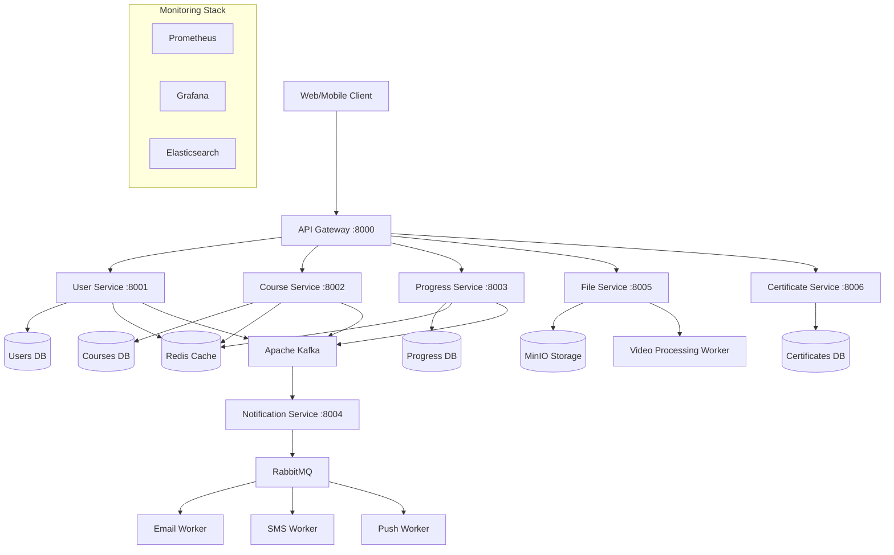

# EduPlatform 🎓

**Современная микросервисная платформа онлайн-обучения**

Комплексное backend приложение на Python:
- Микросервисная архитектура
- Event-driven системы (Apache Kafka)
- Message queues (RabbitMQ)
- Async/await программирование
- Распределенные системы и кэширование
- Мониторинг и наблюдаемость

## 🏗️ Архитектура



## 🚀 Быстрый старт

### Предварительные требования

- Python 3.11+
- Poetry
- Docker & Docker Compose
- Make (опционально)

### Установка

1. **Клонировать и настроить окружение:**
```bash
git clone https://github.com/yourname/eduplatform.git
cd eduplatform

# Установить зависимости
make install
# или
poetry install --extras all

# Создать структуру проекта
make create-structure
```

2. **Настроить переменные окружения:**
```bash
cp .env.example .env
# Отредактировать .env под ваши нужды
```

3. **Запустить инфраструктуру:**
```bash
make infrastructure
# Подождать ~30 секунд для полной инициализации
```

4. **Инициализировать базу данных:**
```bash
make init-db
make seed-data
```

5. **Запустить сервисы для разработки:**
```bash
# В разных терминалах:
make dev-api-gateway    # API Gateway на порту 8000
make dev-user-service   # User Service на порту 8001  
make dev-course-service # Course Service на порту 8002
```

## 🛠️ Доступные команды

```bash
make help                 # Показать все команды
make infrastructure      # Запустить инфраструктуру
make services            # Запустить все микросервисы
make test                # Запустить тесты
make lint                # Проверить код
make format              # Отформатировать код
make health-check        # Проверить статус сервисов
```

## 📊 Доступ к сервисам

После запуска `make infrastructure`:

| Сервис | URL | Логин/Пароль |
|--------|-----|--------------|
| **API Gateway** | http://localhost:8000 | - |
| **Grafana** | http://localhost:3000 | admin/admin |
| **Prometheus** | http://localhost:9090 | - |
| **RabbitMQ Management** | http://localhost:15672 | eduuser/edupass |
| **MinIO Console** | http://localhost:9001 | eduuser/edupassword |
| **Elasticsearch** | http://localhost:9200 | - |

**Базы данных:**
- PostgreSQL: `localhost:5432` (eduuser/edupass)
- Redis: `localhost:6379`
- Kafka: `localhost:9092`

## 🎯 Основные возможности

### 👥 Управление пользователями
- Регистрация и аутентификация
- JWT токены с refresh
- Роли: студент, инструктор, админ
- Профили пользователей

### 📚 Управление курсами
- Создание курсов и уроков
- Категории и теги
- Цены и скидки
- Поиск и фильтрация (Elasticsearch)

### 📈 Отслеживание прогресса
- Прогресс по урокам и курсам
- Аналитика обучения
- Времени тратится на обучение
- Рекомендации курсов

### 🔔 Система уведомлений
- Email уведомления
- SMS уведомления  
- Push уведомления
- Шаблоны сообщений

### 📁 Работа с файлами
- Загрузка видео уроков
- Обработка видео (разные качества)
- Генерация превью
- CDN для быстрой доставки

### 🏆 Сертификаты
- Автоматическая генерация
- PDF сертификаты
- Верификация в блокчейне
- Шаблоны сертификатов

## 🔧 Технический стек

### Backend
- **FastAPI** - современный async веб-фреймворк
- **SQLAlchemy 2.0** - современная ORM с async поддержкой
- **Alembic** - миграции базы данных
- **Pydantic V2** - валидация данных и настройки

### Базы данных  
- **PostgreSQL** - основное хранилище данных
- **Redis** - кэширование и сессии
- **Elasticsearch** - полнотекстовый поиск

### Брокеры сообщений
- **Apache Kafka** - event streaming для микросервисов
- **RabbitMQ** - очереди задач и уведомлений

### Инфраструктура
- **Docker & Docker Compose** - контейнеризация
- **MinIO** - S3-совместимое файловое хранилище
- **Celery** - фоновые задачи

### Мониторинг
- **Prometheus** - сбор метрик
- **Grafana** - дашборды и визуализация  
- **Структурированное логирование** - structlog

### Разработка
- **Poetry** - управление зависимостями
- **Pytest** - тестирование
- **Black + isort** - форматирование кода
- **MyPy** - статическая типизация
- **Pre-commit hooks** - проверки перед коммитом

## 🧪 Тестирование

```bash
# Все тесты
make test

# Только unit тесты  
make test-unit

# Только integration тесты
make test-integration

# С покрытием
poetry run pytest --cov=shared --cov=services --cov-report=html
```

Тесты разделены на:
- **Unit тесты** - изолированные компоненты
- **Integration тесты** - взаимодействие между сервисами  
- **Performance тесты** - нагрузочное тестирование

## 📈 Мониторинг и метрики

### Prometheus метрики
- Количество запросов по сервисам
- Время ответа API
- Ошибки и коды ответов
- Использование ресурсов

### Grafana дашборды
- Обзор платформы
- Метрики пользователей  
- Аналитика курсов
- Производительность сервисов

### Логирование
- Структурированные логи в JSON
- Корреляция между сервисами
- Централизованный сбор логов

## 🔒 Безопасность

- JWT аутентификация с refresh токенами
- Хеширование паролей с bcrypt
- Rate limiting на уровне API Gateway
- Валидация входных данных
- CORS политики
- Сканирование зависимостей на уязвимости

```bash
make security-scan  # Проверить безопасность
```

## 🚀 Деплой в продакшн

```bash
# Собрать продакшн образы
make prod-build

# Задеплоить
make prod-deploy

# Мониторить логи
make prod-logs
```

## 📚 API Документация

После запуска сервисов:
- **Swagger UI**: http://localhost:8000/docs
- **ReDoc**: http://localhost:8000/redoc
- **OpenAPI JSON**: http://localhost:8000/openapi.json

## 🤝 Разработка

### Workflow
1. Создать feature ветку
2. Разработать функционал
3. Написать тесты
4. Запустить `make lint` и `make test`
5. Создать Pull Request

### Добавление нового сервиса
1. Создать директорию в `services/`
2. Добавить в `docker-compose.yml`
3. Настроить роутинг в API Gateway
4. Добавить тесты и документацию

## 🎓 Что демонстрирует этот проект

**Senior Backend навыки:**
- ✅ Микросервисная архитектура
- ✅ Event-driven системы  
- ✅ Distributed systems patterns
- ✅ Async/await программирование
- ✅ Database design & optimization
- ✅ Caching strategies
- ✅ Message queues & streaming
- ✅ Monitoring & observability
- ✅ Testing strategies
- ✅ Security best practices
- ✅ CI/CD готовность
- ✅ Documentation

## 🐛 Устранение неполадок

### Проблемы с запуском
```bash
# Проверить статус сервисов
make health-check

# Посмотреть логи
make logs

# Пересоздать окружение  
make clean && make infrastructure
```

### Проблемы с базой данных
```bash
# Подключиться к БД
make db-shell

# Пересоздать миграции
make create-migration MESSAGE="fix issue"
make migrate
```

### Проблемы с Kafka
```bash
# Посмотреть топики
make kafka-topics

# Читать сообщения
make kafka-consume TOPIC=user.registered
```

## 📞 Поддержка

- **Issues**: GitHub Issues
- **Документация**: `/docs` директория
- **Мониторинг**: Grafana дашборды

---

**Лицензия**: MIT  
**Автор**: Senior Python Developer  
**Версия**: 0.1.0